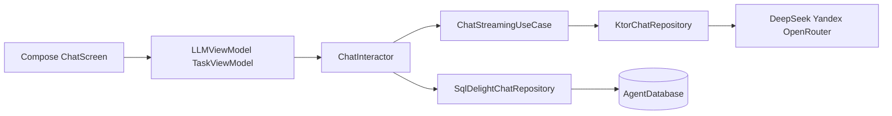

# AI_develop

## Назначение

Десктопный клиент для работы с LLM: чат, управление агентами (профили, память, провайдеры), задачи с ролями **архитектор / исполнитель / валидатор** и отдельный режим **Saga Chat**. Данные и история сохраняются локально; сеть используется только для вызовов API.

Точка входа: [`composeApp/src/desktopMain/kotlin/com/example/ai_develop/main.kt`](composeApp/src/desktopMain/kotlin/com/example/ai_develop/main.kt) — Koin, затем либо GUI (`App` + `LLMViewModel`), либо **`--cli`** (консольный режим через `CliAgentManager` в [`composeApp/src/desktopMain/kotlin/com/example/ai_develop/CliMain.kt`](composeApp/src/desktopMain/kotlin/com/example/ai_develop/CliMain.kt)).

В [`composeApp/build.gradle.kts`](composeApp/build.gradle.kts) объявлен таргет **`jvm("desktop")`**; в репозитории могут оставаться следы других таргетов (например `wasmJsMain`, `androidMain`).

## Стек

| Слой | Технологии |
|------|------------|
| UI | Compose Material3, вкладки в [`ChatScreen.kt`](composeApp/src/commonMain/kotlin/com/example/ai_develop/presentation/compose/ChatScreen.kt): Чат, Агенты, Задачи, Saga Chat |
| DI | Koin ([`Koin.kt`](composeApp/src/commonMain/kotlin/com/example/ai_develop/di/Koin.kt), `expect platformModule` для драйвера БД) |
| Сеть | Ktor Client, JSON (kotlinx.serialization) |
| Локальные данные | SQLDelight [`AgentDatabase.sq`](composeApp/src/commonMain/sqldelight/com/example/ai_develop/database/AgentDatabase.sq) |
| Асинхронность | Coroutines, Flow, Turbine в тестах |

Ключи API подставляются через BuildConfig из `local.properties`: `DEEPSEEK_KEY`, `YANDEX_KEY`, `YANDEX_FOLDER_ID`, `OPENROUTER_KEY` (см. [`composeApp/build.gradle.kts`](composeApp/build.gradle.kts), блок `buildConfig`).

## Основные функции по слоям

### Данные и репозитории

- **`SqlDelightChatRepository`** — единая реализация интерфейсов `ChatRepository`, `AgentRepository`, `TaskRepository`, `MessageRepository`; поверх SQLDelight, сетевые вызовы делегируются в **`KtorChatRepository`** (qualifier `named("network")`).
- Схема БД: состояние агента, профиль, сообщения, инварианты, задачи — см. [`AgentDatabase.sq`](composeApp/src/commonMain/sqldelight/com/example/ai_develop/database/AgentDatabase.sq).
- **`LocalChatRepository`** — абстракция для локального доступа (используется, например, в [`TaskSaga`](composeApp/src/commonMain/kotlin/com/example/ai_develop/domain/TaskSaga.kt) и [`ChatInteractor`](composeApp/src/commonMain/kotlin/com/example/ai_develop/presentation/ChatInteractor.kt)).

### LLM

- Провайдеры модели описаны в [`LLMProvider.kt`](composeApp/src/commonMain/kotlin/com/example/ai_develop/domain/LLMProvider.kt) (sealed class): DeepSeek, Yandex, OpenRouter с дефолтными именами моделей.
- Стриминг и вызовы API — **`ChatStreamingUseCase`** + **`KtorChatRepository`** / [`LLMHandlers.kt`](composeApp/src/commonMain/kotlin/com/example/ai_develop/data/LLMHandlers.kt).

### Агенты и чат

- **`AutonomousAgent`** ([`AutonomousAgent.kt`](composeApp/src/commonMain/kotlin/com/example/ai_develop/domain/AutonomousAgent.kt)) — жизненный цикл агента, подписка на состояние в БД, делегирование исполнения **`AgentEngine`**.
- **`ChatInteractor`** — отправка сообщений: ветвление истории (`ChatMemoryManager`), стриминг ответа, обновление локального состояния/БД.
- **`ChatMemoryManager`**, **`SummarizeChatUseCase`**, **`ExtractFactsUseCase`**, **`UpdateWorkingMemoryUseCase`** — стратегии и обновление «памяти».
- UI-стратегии через **`StrategyDelegateFactory`** и делегаты в [`presentation/strategy/`](composeApp/src/commonMain/kotlin/com/example/ai_develop/presentation/strategy/).

### Задачи и Saga

- **`TaskSaga`** — конечный автомат задачи: состояния `PLANNING` → `EXECUTION` → `VALIDATION` → `DONE`, роли **Architect / Executor / Validator**, пауза, реакция на изменения задачи и списка агентов из `LocalChatRepository`.
- Use cases CRUD задач: **`GetTasksUseCase`**, **`CreateTaskUseCase`**, и т.д. (регистрация в [`Koin.kt`](composeApp/src/commonMain/kotlin/com/example/ai_develop/di/Koin.kt)).
- **`TaskViewModel`** + экраны [`TaskManagementContent.kt`](composeApp/src/commonMain/kotlin/com/example/ai_develop/presentation/compose/TaskManagementContent.kt), [`TaskChatContent.kt`](composeApp/src/commonMain/kotlin/com/example/ai_develop/presentation/compose/TaskChatContent.kt).

### Презентация

- **`LLMViewModel`** — состояние UI чата и взаимодействие с доменом.
- **`AgentManager`** — координация агентов в UI-слое.
- Корневой UI: [`App.kt`](composeApp/src/commonMain/kotlin/com/example/ai_develop/presentation/compose/App.kt) → `ChatScreen`.

## Схема потока (упрощённо)

## Тесты

В [`composeApp/src/commonTest/`](composeApp/src/commonTest/kotlin/com/example/ai_develop/) — тесты саги (`TaskSaga*`), интерактора, ViewModel и др.; часть старых тестов БД могла быть удалена при миграции с Room на SQLDelight.

## Итог

Проект реализует **полнофункциональный локальный агентный чат-клиент** с несколькими LLM, персистентностью, ветвлением/памятью и **оркестрацией многошаговых задач** через Task Saga; сборка ориентирована на **Desktop JVM** с опциональным **CLI**.
